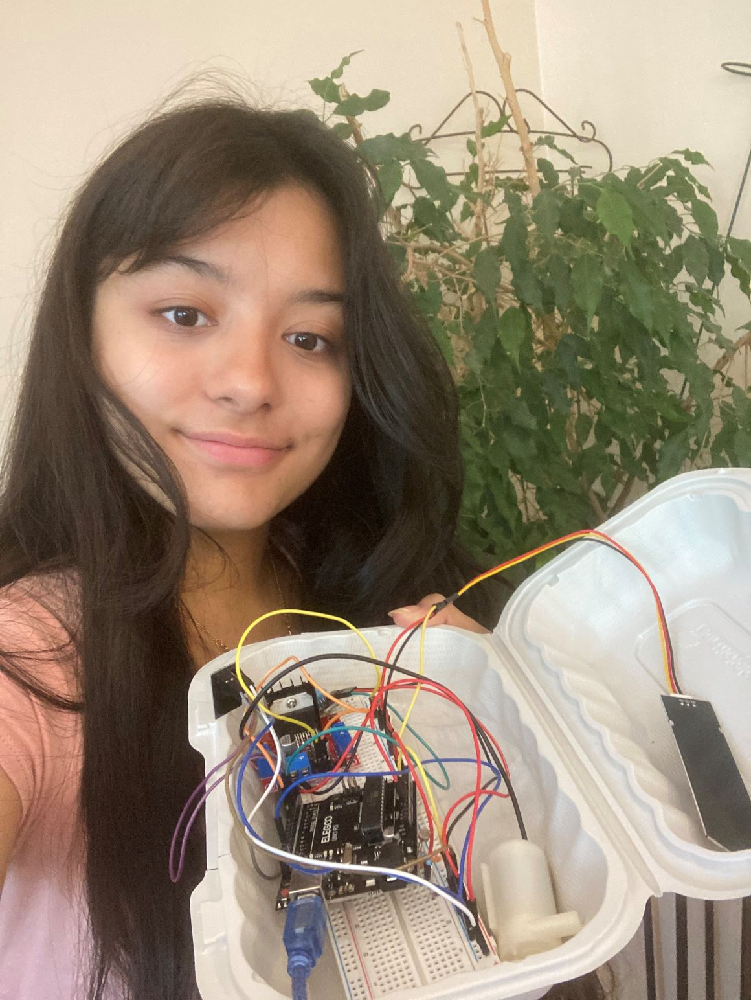
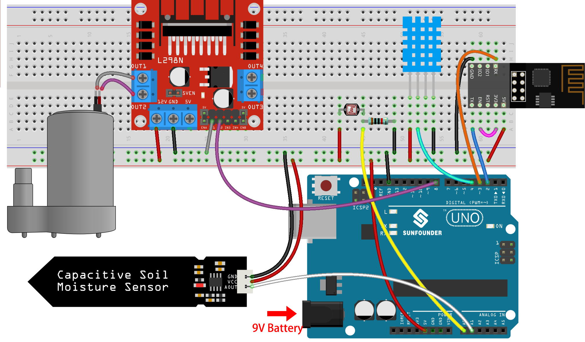

# Plant Monitor
When it comes to tending to your plants, even if you find yourself lacking the motivation to water them, the plant monitor comes to the rescue. It enables you to effortlessly keep track of essential factors such as light exposure, soil moisture, air temperature, and humidity, all without being in close proximity to your plants. With this remarkable device, you can luxuriate to your heart's content while the plant monitor diligently takes care of the necessary tasks. This is precisely why I undertook the endeavor of creating a plant monitor that can effortlessly water plants with just a simple click of a button. Admittedly, I encountered some challenges along the way, particularly in terms of coding and wiring, which I will elaborate on in greater detail later on.

| **Engineer** | **School** | **Area of Interest** | **Grade** |
|:--:|:--:|:--:|:--:|
| Hannah L | Westfield High School | Electrical Engineering | Incoming Senior



  
# Final Milestone

**Don't forget to replace the text below with the embedding for your milestone video. Go to Youtube, click Share -> Embed, and copy and paste the code to replace what's below.**

<iframe width="560" height="315" src="https://www.youtube.com/embed/F7M7imOVGug" title="YouTube video player" frameborder="0" allow="accelerometer; autoplay; clipboard-write; encrypted-media; gyroscope; picture-in-picture; web-share" allowfullscreen></iframe>

For your final milestone, explain the outcome of your project. Key details to include are:
- What you've accomplished since your previous milestone
- What your biggest challenges and triumphs were at BSE
- A summary of key topics you learned about
- What you hope to learn in the future after everything you've learned at BSE


# Second Milestone

**Don't forget to replace the text below with the embedding for your milestone video. Go to Youtube, click Share -> Embed, and copy and paste the code to replace what's below.**

<iframe width="560" height="315" src="https://www.youtube.com/embed/y3VAmNlER5Y" title="YouTube video player" frameborder="0" allow="accelerometer; autoplay; clipboard-write; encrypted-media; gyroscope; picture-in-picture; web-share" allowfullscreen></iframe>

For your second milestone, explain what you've worked on since your previous milestone. You can highlight:
- Technical details of what you've accomplished and how they contribute to the final goal
- What has been surprising about the project so far
- Previous challenges you faced that you overcame
- What needs to be completed before your final milestone 

# First Milestone

**Don't forget to replace the text below with the embedding for your milestone video. Go to Youtube, click Share -> Embed, and copy and paste the code to replace what's below.**

<iframe width="560" height="315" src="https://www.youtube.com/embed/CaCazFBhYKs" title="YouTube video player" frameborder="0" allow="accelerometer; autoplay; clipboard-write; encrypted-media; gyroscope; picture-in-picture; web-share" allowfullscreen></iframe>

For your first milestone, describe what your project is and how you plan to build it. You can include:
- An explanation about the different components of your project and how they will all integrate together
- Technical progress you've made so far
- Challenges you're facing and solving in your future milestones
- What your plan is to complete your project

# Schematics 
**Final Milestone Schematic**

by: Sunfounder

# Code

```c++
// Template ID, Device Name and Auth Token are provided by the Blynk.Cloud
// See the Device Info tab, or Template settings
#define BLYNK_TEMPLATE_ID "TMPL2CH3iQYh3"
#define BLYNK_TEMPLATE_NAME "Quickstart Template"
#define BLYNK_AUTH_TOKEN "jiRZp4N6ZknxSm4KzedR-fAp62gOflKZ"


// Comment this out to disable prints and save space
#define BLYNK_PRINT Serial

#include <ESP8266_Lib.h>
#include <BlynkSimpleShieldEsp8266.h>

char auth[] = BLYNK_AUTH_TOKEN;

// Your WiFi credentials.
// Set password to "" for open networks.
char ssid[] = "FIOS-RLPJ-5G";
char pass[] = "sky2773lori6378wit";

// Hardware Serial on Mega, Leonardo, Micro...
// #define EspSerial Serial1

// or Software Serial on Uno, Nano...
#include <SoftwareSerial.h>
SoftwareSerial EspSerial(2, 3); // RX, TX

// Your ESP8266 baud rate:
#define ESP8266_BAUD 9600

ESP8266 wifi(&EspSerial);

#include <dht11.h>
dht11 DHT11;
#define DHT11_PIN 4
#define lightPin A0
#define moisturePin A1
#define pumpA 8

double roomHumidity = 0;
double roomTemperature = 0;

BlynkTimer timer;

BLYNK_WRITE(V0)
{
  if (param.asInt() == 1) {
    digitalWrite(pumpA, HIGH);
  } else {
    digitalWrite(pumpA, LOW);
  }
}

int readMoisture() {
  return analogRead(moisturePin);
}

int readLight() {
  return analogRead(lightPin);
}

bool readDHT() {
  int chk = DHT11.read(DHT11_PIN);
  switch (chk)
  {
    case DHTLIB_OK:
      roomHumidity = DHT11.humidity;
      roomTemperature = DHT11.temperature;
      return true;
    case DHTLIB_ERROR_CHECKSUM:
      break;
    case DHTLIB_ERROR_TIMEOUT:
      break;
    default:
      break;
  }
  return false;
}

void myTimerEvent()
{
  bool chk = readDHT();
  int light = readLight();
  int moisture = readMoisture();
  if (chk == true) {
    Blynk.virtualWrite(V4, roomHumidity);
    Blynk.virtualWrite(V5, roomTemperature);
  }
  Blynk.virtualWrite(V6, light);
  Blynk.virtualWrite(V7, moisture);
}

void setup()
{
  // Debug console
  Serial.begin(115200);

  // Set ESP8266 baud rate
  EspSerial.begin(ESP8266_BAUD);
  delay(10);

  Blynk.begin(auth, wifi, ssid, pass);
  // You can also specify server:
  //Blynk.begin(auth, wifi, ssid, pass, "blynk.cloud", 80);
  //Blynk.begin(auth, wifi, ssid, pass, IPAddress(192,168,1,100), 8080);

  timer.setInterval(1000L, myTimerEvent);

  pinMode(pumpA, OUTPUT);
}

void loop()
{
  Blynk.run();
  timer.run(); // Initiates BlynkTimer
}

```

# Bill of Materials
Here's where you'll list the parts in your project. To add more rows, just copy and paste the example rows below.
Don't forget to place the link of where to buy each component inside the quotation marks in the corresponding row after href =. Follow the guide [here]([url](https://www.markdownguide.org/extended-syntax/)) to learn how to customize this to your project needs. 

| **Part** | **Note** | **Price** | **Link** |
|:--:|:--:|:--:|:--:|
| Arduino uno R3| The Arduino board is used for creating and controlling electronic projects by running pre-written software code. | $29.99 | <a href= "https://www.amazon.com/ELEGOO-Board-ATmega328P-ATMEGA16U2-Compliant/dp/B01EWOE0UU/ref=sr_1_2_sspa?keywords=arduino+uno&qid=1689602454&sr=8-2-spons&sp_csd=d2lkZ2V0TmFtZT1zcF9hdGY&psc=1"> Link </a> |
| ESP-8266 ESP-01 | The ESP8266 allows devices to connect and communicate with each other and the internet wirelessly. | $8.99 | <a href="https://www.amazon.com/HiLetgo-Wireless-Transceiver-Development-Compatible/dp/B010N1ROQS/ref=sr_1_1_sspa?crid=A14YBZ0VN5AM&keywords=esp8266&qid=1689603294&sprefix=esp8266%2Caps%2C124&sr=8-1-spons&sp_csd=d2lkZ2V0TmFtZT1zcF9hdGY&psc=1"> Link </a> |
| Breadboard | used for quickly and easily building and testing electronic circuits without the need for soldering | $9.99 | <a href="https://www.amazon.com/Breadboards-Solderless-Breadboard-Distribution-Connecting/dp/B07DL13RZH/ref=sr_1_1_sspa?keywords=breadboard&qid=1689603906&sr=8-1-spons&sp_csd=d2lkZ2V0TmFtZT1zcF9hdGY&psc=1"> Link </a> |
| Breadboard jumper wires| A breadboard jumper is a short wire with connectors on both ends, used to establish electrical connections between different points on a breadboard | $9.99| <a href="https://www.amazon.com/Solderless-Flexible-Breadboard-Jumper-100pcs/dp/B005TZJ0AM/ref=sr_1_6?crid=32WQ9EBPDKZW5&keywords=breadboard+jumper&qid=1689604452&sprefix=breadboard+jumper%2Caps%2C573&sr=8-6"> Link </a> |
| soil moisture sensor| It sense the moisture levels in the soil | $11.99 | <a href="https://www.amazon.com/Capacitive-Moisture-Corrosion-Resistant-Detection/dp/B07SYBSHGX/ref=sr_1_8?crid=3S5RB1JSWSSC4&keywords=soil+moisture+sensor&qid=1689606335&sprefix=soil+mo%2Caps%2C155&sr=8-8"> Link </a> |
| DHT 11| The DHT11 is used to measure and provide real-time data on temperature and humidity | $5.99 | <a href="https://www.amazon.com/BOJACK-Temperature-Humidity-Digital-Raspberry/dp/B09TKTZMSL/ref=sr_1_2_sspa?crid=2HE0469RXYMHL&keywords=dht11&qid=1690378979&sprefix=dht11%2Caps%2C114&sr=8-2-spons&sp_csd=d2lkZ2V0TmFtZT1zcF9hdGY&th=1"> Link </a> |
| Mini water pump| It pumps water | $6.29 | <a href="https://www.amazon.com/Sipytoph-Submersible-Aquariums-Fountain-Hydroponics/dp/B09185Y8BN/ref=sr_1_20_sspa?crid=3Q9IR5KN34LI&keywords=mini+water+pump&qid=1690379049&sprefix=mini+water+%2Caps%2C107&sr=8-20-spons&sp_csd=d2lkZ2V0TmFtZT1zcF9tdGY&psc=1"> Link </a> |
| L289n dual motor| used to control and drive the direction and speed of two DC motors | $6.99 | <a href="https://www.amazon.com/Controller-Bridge-Stepper-Control-Drives/dp/B09NRB38QT/ref=sr_1_3?crid=BX478DQGH9A&keywords=l289n+dual+motor&qid=1690379514&sprefix=l289n+dual+motor%2Caps%2C130&sr=8-3"> Link </a> |


# Other Resources/Examples
One of the best parts about Github is that you can view how other people set up their own work. Here are some past BSE portfolios that are awesome examples. You can view how they set up their portfolio, and you can view their index.md files to understand how they implemented different portfolio components.
- [Example 1](https://trashytuber.github.io/YimingJiaBlueStamp/)
- [Example 2](https://sviatil0.github.io/Sviatoslav_BSE/)
- [Example 3](https://arneshkumar.github.io/arneshbluestamp/)

To watch the BSE tutorial on how to create a portfolio, click here.
