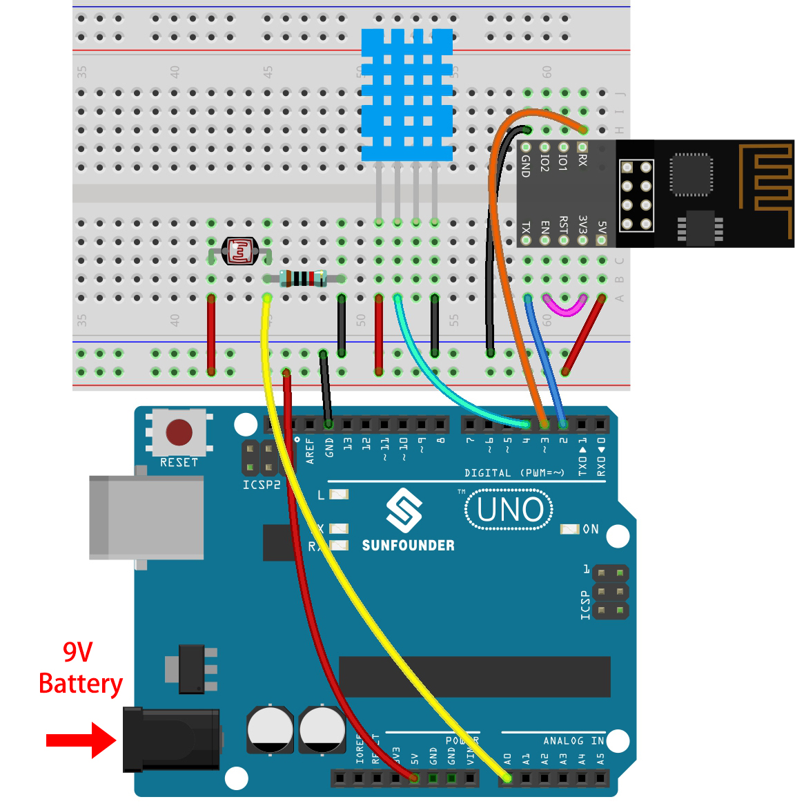
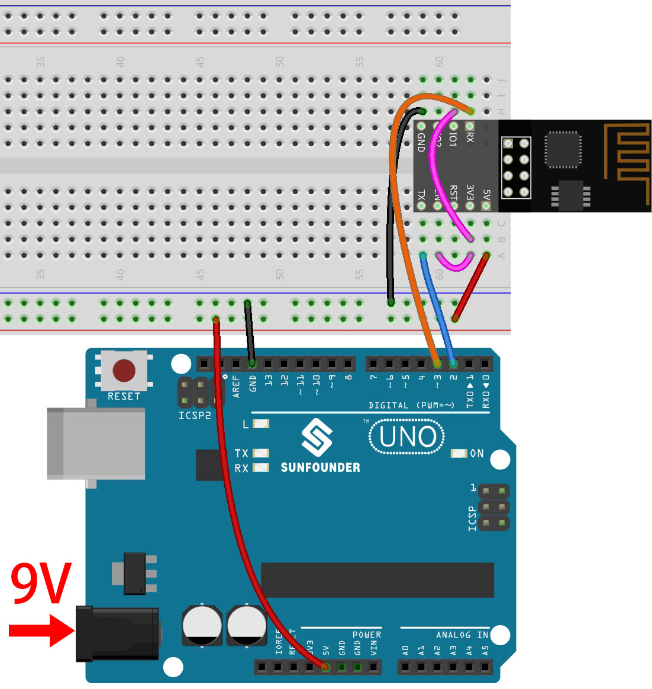

# Plant Monitor
When it comes to tending to your plants, even if you find yourself lacking the motivation to water them, the plant monitor comes to the rescue. It enables you to effortlessly keep track of essential factors such as light exposure, soil moisture, air temperature, and humidity, all without being in close proximity to your plants. With this remarkable device, you can luxuriate to your heart's content while the plant monitor diligently takes care of the necessary tasks. This is precisely why I undertook the endeavor of creating a plant monitor that can effortlessly water plants with just a simple click of a button. Admittedly, I encountered some challenges along the way, particularly in terms of coding and wiring, which I will elaborate on in greater detail later on.

| **Engineer** | **School** | **Area of Interest** | **Grade** |
|:--:|:--:|:--:|:--:|
| Hannah L | Westfield High School | Electrical Engineering | Incoming Senior


  
# Final Milestone

For my final milestone, I successfully integrated the dual motor, mini water pump, and soil moisture sensor into my project. Building on the progress since my last milestone, I implemented code that enables the mini water pump to activate through a button in Blynk. As a result, when the button is toggled on, the water pump starts functioning seamlessly. Additionally, I enhanced the code to enable the soil moisture sensor to retrieve real-time data, which is then conveniently displayed on the Blynk dashboard.
Throughout my journey at Bluestamp Engineering, I encountered one of my biggest challenges - dealing with constant trial and error. Whenever the code failed to work, my approach involved a systematic process. Firstly, I meticulously checked all the wiring to ensure correctness. Next, I inspected each component to rule out any potential faults. Finally, I double-checked the code for any issues. This problem-solving experience taught me valuable lessons on how to articulate and detail my problems better, leading to more effective solutions. I also learned the importance of seeking help and utilizing available resources effectively. As I move forward, my aspiration is to continue refining my problem-solving skills, aiming to tackle challenges efficiently and effectively.

**Final Milestone Schematic**

by: Sunfounder


# Second Milestone

I have successfully integrated the DHT11 sensor and implemented code to transmit and display humidity, temperature, and light intensity data on the Blynk platform. The DHT11 plays a crucial role in the project as it continuously monitors the plant's surroundings. It's fascinating how the project can connect to the internet and interact with Blynk, allowing convenient control through the Blynk dashboard. During the implementation of the DHT11, I encountered some challenges with the initial library choice, but I resolved this by switching to a suitable library and modifying the code accordingly. To enhance the project's functionality, I plan to add three more components, which will enable me to monitor the soil moisture level and water the plant when it becomes too dry.

**Second Milestone Schematic**

by: Sunfounder

# First Milestone


Up to this point, I have successfully configured the ESP8266-01 and established a connection to both the Wi-Fi network and the Blynk platform. This step is crucial as the Blynk dashboard will serve as a centralized display for data from other components. However, the setup of the ESP8266-01 presented significant challenges, mainly due to the module initially being unresponsive. After troubleshooting, I discovered that the Rx and Tx pins were inadvertently switched, causing communication issues. Additionally, I learned that the ESP8266-01 required the EN (Enable) pin to be correctly connected to the 3.3V power source to ensure proper operation.


**First Milestone Schematic**

by: Sunfounder


# Final Code For Plant Monitor

```c++
// Template ID, Device Name and Auth Token are provided by the Blynk.Cloud
// See the Device Info tab, or Template settings
#define BLYNK_TEMPLATE_ID "TMPL2CH3iQYh3"
#define BLYNK_TEMPLATE_NAME "Quickstart Template"
#define BLYNK_AUTH_TOKEN "jiRZp4N6ZknxSm4KzedR-fAp62gOflKZ"


// Comment this out to disable prints and save space
#define BLYNK_PRINT Serial

#include <ESP8266_Lib.h>
#include <BlynkSimpleShieldEsp8266.h>

char auth[] = BLYNK_AUTH_TOKEN;

// Your WiFi credentials.
// Set password to "" for open networks.
char ssid[] = "FIOS-RLPJ-5G";
char pass[] = "sky2773lori6378wit";

// Hardware Serial on Mega, Leonardo, Micro...
// #define EspSerial Serial1

// or Software Serial on Uno, Nano...
#include <SoftwareSerial.h>
SoftwareSerial EspSerial(2, 3); // RX, TX

// Your ESP8266 baud rate:
#define ESP8266_BAUD 9600

ESP8266 wifi(&EspSerial);

#include <dht11.h>
dht11 DHT11;
#define DHT11_PIN 4
#define lightPin A0
#define moisturePin A1
#define pumpA 8

double roomHumidity = 0;
double roomTemperature = 0;

BlynkTimer timer;

BLYNK_WRITE(V0)
{
  if (param.asInt() == 1) {
    digitalWrite(pumpA, HIGH);
  } else {
    digitalWrite(pumpA, LOW);
  }
}

int readMoisture() {
  return analogRead(moisturePin);
}

int readLight() {
  return analogRead(lightPin);
}

bool readDHT() {
  int chk = DHT11.read(DHT11_PIN);
  switch (chk)
  {
    case DHTLIB_OK:
      roomHumidity = DHT11.humidity;
      roomTemperature = DHT11.temperature;
      return true;
    case DHTLIB_ERROR_CHECKSUM:
      break;
    case DHTLIB_ERROR_TIMEOUT:
      break;
    default:
      break;
  }
  return false;
}

void myTimerEvent()
{
  bool chk = readDHT();
  int light = readLight();
  int moisture = readMoisture();
  if (chk == true) {
    Blynk.virtualWrite(V4, roomHumidity);
    Blynk.virtualWrite(V5, roomTemperature);
  }
  Blynk.virtualWrite(V6, light);
  Blynk.virtualWrite(V7, moisture);
}

void setup()
{
  // Debug console
  Serial.begin(115200);

  // Set ESP8266 baud rate
  EspSerial.begin(ESP8266_BAUD);
  delay(10);

  Blynk.begin(auth, wifi, ssid, pass);
  // You can also specify server:
  //Blynk.begin(auth, wifi, ssid, pass, "blynk.cloud", 80);
  //Blynk.begin(auth, wifi, ssid, pass, IPAddress(192,168,1,100), 8080);

  timer.setInterval(1000L, myTimerEvent);

  pinMode(pumpA, OUTPUT);
}

void loop()
{
  Blynk.run();
  timer.run(); // Initiates BlynkTimer
}

```

# Bill of Materials

| **Part** | **Note** | **Price** | **Link** |
|:--:|:--:|:--:|:--:|
| Arduino uno R3| The Arduino board is used for creating and controlling electronic projects by running pre-written software code. | $29.99 | <a href= "https://www.amazon.com/ELEGOO-Board-ATmega328P-ATMEGA16U2-Compliant/dp/B01EWOE0UU/ref=sr_1_2_sspa?keywords=arduino+uno&qid=1689602454&sr=8-2-spons&sp_csd=d2lkZ2V0TmFtZT1zcF9hdGY&psc=1"> Link </a> |
| ESP-8266 ESP-01 | The ESP8266 allows devices to connect and communicate with each other and the internet wirelessly. | $8.99 | <a href="https://www.amazon.com/HiLetgo-Wireless-Transceiver-Development-Compatible/dp/B010N1ROQS/ref=sr_1_1_sspa?crid=A14YBZ0VN5AM&keywords=esp8266&qid=1689603294&sprefix=esp8266%2Caps%2C124&sr=8-1-spons&sp_csd=d2lkZ2V0TmFtZT1zcF9hdGY&psc=1"> Link </a> |
| Breadboard | used for quickly and easily building and testing electronic circuits without the need for soldering | $9.99 | <a href="https://www.amazon.com/Breadboards-Solderless-Breadboard-Distribution-Connecting/dp/B07DL13RZH/ref=sr_1_1_sspa?keywords=breadboard&qid=1689603906&sr=8-1-spons&sp_csd=d2lkZ2V0TmFtZT1zcF9hdGY&psc=1"> Link </a> |
| Breadboard jumper wires| A breadboard jumper is a short wire with connectors on both ends, used to establish electrical connections between different points on a breadboard | $9.99| <a href="https://www.amazon.com/Solderless-Flexible-Breadboard-Jumper-100pcs/dp/B005TZJ0AM/ref=sr_1_6?crid=32WQ9EBPDKZW5&keywords=breadboard+jumper&qid=1689604452&sprefix=breadboard+jumper%2Caps%2C573&sr=8-6"> Link </a> |
| soil moisture sensor| It sense the moisture levels in the soil | $11.99 | <a href="https://www.amazon.com/Capacitive-Moisture-Corrosion-Resistant-Detection/dp/B07SYBSHGX/ref=sr_1_8?crid=3S5RB1JSWSSC4&keywords=soil+moisture+sensor&qid=1689606335&sprefix=soil+mo%2Caps%2C155&sr=8-8"> Link </a> |
| DHT 11| The DHT11 is used to measure and provide real-time data on temperature and humidity | $5.99 | <a href="https://www.amazon.com/BOJACK-Temperature-Humidity-Digital-Raspberry/dp/B09TKTZMSL/ref=sr_1_2_sspa?crid=2HE0469RXYMHL&keywords=dht11&qid=1690378979&sprefix=dht11%2Caps%2C114&sr=8-2-spons&sp_csd=d2lkZ2V0TmFtZT1zcF9hdGY&th=1"> Link </a> |
| Mini water pump| It pumps water | $6.29 | <a href="https://www.amazon.com/Sipytoph-Submersible-Aquariums-Fountain-Hydroponics/dp/B09185Y8BN/ref=sr_1_20_sspa?crid=3Q9IR5KN34LI&keywords=mini+water+pump&qid=1690379049&sprefix=mini+water+%2Caps%2C107&sr=8-20-spons&sp_csd=d2lkZ2V0TmFtZT1zcF9tdGY&psc=1"> Link </a> |
| L289n dual motor| used to control and drive the direction and speed of two DC motors | $6.99 | <a href="https://www.amazon.com/Controller-Bridge-Stepper-Control-Drives/dp/B09NRB38QT/ref=sr_1_3?crid=BX478DQGH9A&keywords=l289n+dual+motor&qid=1690379514&sprefix=l289n+dual+motor%2Caps%2C130&sr=8-3"> Link </a> |

